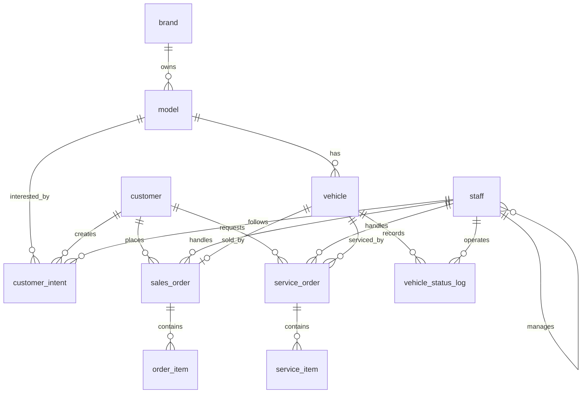

# 汽车销售管理系统数据库设计说明书

## 1. 设计范围

本说明书以当前项目实际数据库实现为依据，主要说明汽车销售管理系统的数据库逻辑设计与数据库对象设计。数据库采用 openGauss，核心脚本位于 `sql/` 目录：

- `01_create_schema.sql`：表结构、主键、外键、唯一约束、检查约束。
- `03_views.sql`：统计视图与分析视图。
- `04_indexes.sql`：业务查询索引。
- `05_triggers.sql`：车辆状态联动触发器。
- `06_procedures.sql`：销售下单、月报、客户历史查询存储过程。

本文不重点讨论前端和后端代码实现，只在必要处说明数据库对象如何支撑业务规则。

## 2. 核心实体

系统围绕“车辆目录、库存车辆、客户、员工、销售订单、售后服务”建模，实际实现包含 12 个关系表。

| 实体 | 表名 | 说明 |
| --- | --- | --- |
| 品牌 | `brand` | 车辆品牌主数据 |
| 车型 | `model` | 产品目录，隶属于品牌 |
| 客户 | `customer` | 购车和售后客户信息 |
| 员工 | `staff` | 销售、库存、售后人员及上下级关系 |
| 库存车辆 | `vehicle` | 每一台实车，以 VIN 作为主键 |
| 客户意向 | `customer_intent` | 客户意向车型、跟进员工、下次联系时间 |
| 销售订单 | `sales_order` | 客户购买某一台具体车辆的订单 |
| 订单明细 | `order_item` | 车辆价格、选装、保险、折扣、其他费用 |
| 服务工单 | `service_order` | 售后保养、维修或其他服务 |
| 服务明细 | `service_item` | 服务项目、配件、数量、单价、金额 |
| 车辆状态日志 | `vehicle_status_log` | 记录车辆状态流转历史 |

## 3. E-R 模型



主要关系说明：

- 一个品牌包含多个车型，一个车型属于一个品牌。
- 一个车型对应多台实车，一台实车只属于一个车型。
- 一名客户可以产生多个购车意向和多个销售订单。
- 一名员工可以跟进多个客户意向、处理多个销售订单或服务工单。
- 一台库存车辆最多对应一个销售订单，实际通过 `sales_order.vehicle_vin` 的唯一约束保证。
- 一张销售订单包含多条订单明细。
- 一张服务工单包含多条服务明细。
- 车辆状态变化写入 `vehicle_status_log`，形成审计记录。

## 4. 关系模式与约束

以下关系模式均按 3NF 设计：每个表只描述单一主题，非主属性依赖本表主键，不保存可由其他表稳定推导的重复属性。统计结果通过视图计算，不落入基础表。

### 4.1 主数据表

#### brand

| 字段 | 类型 | 约束 | 说明 |
| --- | --- | --- | --- |
| `brand_id` | `SERIAL` | PK | 品牌 ID |
| `brand_name` | `VARCHAR(40)` | NOT NULL, UNIQUE | 品牌名称 |

#### model

| 字段 | 类型 | 约束 | 说明 |
| --- | --- | --- | --- |
| `model_id` | `SERIAL` | PK | 车型 ID |
| `brand_id` | `INT` | FK -> `brand.brand_id`, NOT NULL | 所属品牌 |
| `model_name` | `VARCHAR(80)` | NOT NULL | 车系/车型名称 |
| `model_year` | `INT` | NOT NULL | 年款 |
| `trim_name` | `VARCHAR(80)` | NOT NULL | 配置名称 |
| `msrp` | `NUMERIC(12,2)` | NOT NULL, `>= 0` | 指导价 |
| `engine_displacement` | `NUMERIC(4,1)` | NOT NULL, `> 0` | 排量 |
| `model_type` | `VARCHAR(30)` | NOT NULL | 车型类型 |
| `safety_stock_threshold` | `INT` | NOT NULL, DEFAULT 2, `>= 0` | 安全库存阈值 |

唯一约束：`(brand_id, model_name, model_year, trim_name)`，避免同品牌下同年款同配置车型重复。

### 4.2 人员与客户表

#### customer

| 字段 | 类型 | 约束 | 说明 |
| --- | --- | --- | --- |
| `customer_id` | `SERIAL` | PK | 客户 ID |
| `customer_name` | `VARCHAR(50)` | NOT NULL | 客户姓名 |
| `gender` | `VARCHAR(10)` | CHECK in `M/F/OTHER` or NULL | 性别 |
| `phone` | `VARCHAR(20)` | NOT NULL, UNIQUE | 手机号 |
| `id_card` | `VARCHAR(32)` | NOT NULL, UNIQUE | 身份证号/证件号 |
| `address` | `VARCHAR(200)` |  | 地址 |
| `first_visit_date` | `DATE` | NOT NULL | 首次到店日期 |
| `source_channel` | `VARCHAR(30)` |  | 来源渠道 |

#### staff

| 字段 | 类型 | 约束 | 说明 |
| --- | --- | --- | --- |
| `staff_id` | `SERIAL` | PK | 员工 ID |
| `staff_no` | `VARCHAR(30)` | NOT NULL, UNIQUE | 员工工号 |
| `staff_name` | `VARCHAR(50)` | NOT NULL | 员工姓名 |
| `role` | `VARCHAR(30)` | NOT NULL | 角色 |
| `department` | `VARCHAR(30)` | NOT NULL | 部门 |
| `hire_date` | `DATE` | NOT NULL | 入职日期 |
| `manager_id` | `INT` | FK -> `staff.staff_id` | 上级员工 |

`staff.manager_id` 是自引用外键，用于表达销售主管等上下级关系。

### 4.3 库存与销售表

#### vehicle

| 字段 | 类型 | 约束 | 说明 |
| --- | --- | --- | --- |
| `vehicle_vin` | `CHAR(17)` | PK | 车辆 VIN |
| `model_id` | `INT` | FK -> `model.model_id`, NOT NULL | 所属车型 |
| `engine_no` | `VARCHAR(32)` | NOT NULL, UNIQUE | 发动机号 |
| `color` | `VARCHAR(20)` | NOT NULL | 颜色 |
| `manufacture_date` | `DATE` | NOT NULL | 生产日期 |
| `inventory_in_date` | `DATE` |  | 入库日期 |
| `purchase_cost` | `NUMERIC(12,2)` | NOT NULL, `>= 0` | 采购成本 |
| `suggested_retail_price` | `NUMERIC(12,2)` | NOT NULL, `>= 0` | 建议零售价 |
| `current_status` | `VARCHAR(20)` | NOT NULL, CHECK | 当前状态 |

车辆状态限制为：`IN_TRANSIT`、`IN_INVENTORY`、`LOCKED`、`SOLD`。

#### customer_intent

| 字段 | 类型 | 约束 | 说明 |
| --- | --- | --- | --- |
| `intent_id` | `SERIAL` | PK | 意向 ID |
| `customer_id` | `INT` | FK -> `customer.customer_id`, NOT NULL | 客户 |
| `model_id` | `INT` | FK -> `model.model_id`, NOT NULL | 意向车型 |
| `intent_level` | `VARCHAR(20)` | NOT NULL | 意向等级 |
| `remark` | `VARCHAR(500)` |  | 备注 |
| `staff_id` | `INT` | FK -> `staff.staff_id`, NOT NULL | 跟进员工 |
| `next_contact_time` | `TIMESTAMP` |  | 下次联系时间 |
| `created_at` | `TIMESTAMP` | NOT NULL, DEFAULT CURRENT_TIMESTAMP | 创建时间 |

说明：当前数据库层未对 `intent_level` 设置检查约束，该字段取值由应用层控制。

#### sales_order

| 字段 | 类型 | 约束 | 说明 |
| --- | --- | --- | --- |
| `order_id` | `SERIAL` | PK | 订单 ID |
| `customer_id` | `INT` | FK -> `customer.customer_id`, NOT NULL | 客户 |
| `staff_id` | `INT` | FK -> `staff.staff_id`, NOT NULL | 销售顾问 |
| `vehicle_vin` | `CHAR(17)` | FK -> `vehicle.vehicle_vin`, NOT NULL, UNIQUE | 所售车辆 |
| `total_amount` | `NUMERIC(12,2)` | NOT NULL, `>= 0` | 订单总金额 |
| `deposit_amount` | `NUMERIC(12,2)` | NOT NULL, DEFAULT 0, `>= 0` | 定金 |
| `order_status` | `VARCHAR(20)` | NOT NULL, CHECK | 订单状态 |
| `created_at` | `TIMESTAMP` | NOT NULL, DEFAULT CURRENT_TIMESTAMP | 创建时间 |
| `delivery_time` | `TIMESTAMP` |  | 交车时间 |

订单状态限制为：`LOCKED`、`DEPOSIT_PAID`、`COMPLETED`、`CANCELLED`。  
金额约束：`deposit_amount <= total_amount`。  
车辆唯一约束：`uk_sales_order_vehicle_vin` 保证一台车最多生成一张销售订单。

#### order_item

| 字段 | 类型 | 约束 | 说明 |
| --- | --- | --- | --- |
| `item_id` | `SERIAL` | PK | 明细 ID |
| `order_id` | `INT` | FK -> `sales_order.order_id`, NOT NULL | 所属订单 |
| `item_type` | `VARCHAR(20)` | NOT NULL, CHECK | 明细类型 |
| `item_desc` | `VARCHAR(200)` | NOT NULL | 项目描述 |
| `amount` | `NUMERIC(12,2)` | NOT NULL | 金额 |

明细类型限制为：`VEHICLE`、`OPTION`、`INSURANCE`、`DISCOUNT`、`OTHER`。

### 4.4 售后服务表

#### service_order

| 字段 | 类型 | 约束 | 说明 |
| --- | --- | --- | --- |
| `service_order_id` | `SERIAL` | PK | 服务工单 ID |
| `customer_id` | `INT` | FK -> `customer.customer_id`, NOT NULL | 客户 |
| `staff_id` | `INT` | FK -> `staff.staff_id`, NOT NULL | 服务顾问 |
| `vehicle_vin` | `CHAR(17)` | FK -> `vehicle.vehicle_vin`, NOT NULL | 服务车辆 |
| `service_type` | `VARCHAR(20)` | NOT NULL, CHECK | 服务类型 |
| `created_at` | `TIMESTAMP` | NOT NULL, DEFAULT CURRENT_TIMESTAMP | 创建时间 |
| `expected_finish_time` | `TIMESTAMP` |  | 预计完成时间 |
| `total_fee` | `NUMERIC(12,2)` | NOT NULL, DEFAULT 0, `>= 0` | 总费用 |
| `status` | `VARCHAR(20)` | NOT NULL, CHECK | 工单状态 |

服务类型限制为：`MAINTENANCE`、`REPAIR`、`OTHER`。  
工单状态限制为：`CREATED`、`IN_PROGRESS`、`COMPLETED`、`CANCELLED`。

#### service_item

| 字段 | 类型 | 约束 | 说明 |
| --- | --- | --- | --- |
| `item_id` | `SERIAL` | PK | 明细 ID |
| `service_order_id` | `INT` | FK -> `service_order.service_order_id`, NOT NULL | 所属服务工单 |
| `item_name` | `VARCHAR(80)` | NOT NULL | 项目/配件名称 |
| `quantity` | `NUMERIC(12,2)` | NOT NULL, `> 0` | 数量 |
| `unit_price` | `NUMERIC(12,2)` | NOT NULL, `>= 0` | 单价 |
| `amount` | `NUMERIC(12,2)` | NOT NULL, `>= 0` | 金额 |

### 4.5 状态审计表

#### vehicle_status_log

| 字段 | 类型 | 约束 | 说明 |
| --- | --- | --- | --- |
| `log_id` | `SERIAL` | PK | 日志 ID |
| `vehicle_vin` | `CHAR(17)` | FK -> `vehicle.vehicle_vin`, NOT NULL | 车辆 VIN |
| `from_status` | `VARCHAR(20)` | CHECK or NULL | 原状态 |
| `to_status` | `VARCHAR(20)` | NOT NULL, CHECK | 新状态 |
| `changed_at` | `TIMESTAMP` | NOT NULL, DEFAULT CURRENT_TIMESTAMP | 变更时间 |
| `staff_id` | `INT` | FK -> `staff.staff_id` | 操作员工 |
| `reason` | `VARCHAR(200)` |  | 变更原因 |

`from_status` 与 `to_status` 使用与 `vehicle.current_status` 相同的状态集合，保证状态日志与车辆主表口径一致。

## 5. 规范化说明

本设计符合 3NF 的主要依据如下：

1. 品牌、车型、客户、员工、车辆、订单、工单等主题分别建表，避免将不同业务主题混合在同一关系中。
2. 车型信息不重复存储在车辆表中，车辆表仅保存 `model_id` 外键。
3. 客户信息不重复存储在订单和工单中，订单、工单仅保存 `customer_id`。
4. 员工信息不重复存储在订单、意向、工单、日志中，只通过 `staff_id` 引用。
5. 订单金额构成拆分到 `order_item`，避免在 `sales_order` 中为每类费用设置重复字段。
6. 售后服务项目拆分到 `service_item`，避免服务工单出现重复项目组。
7. 销售业绩、库存汇总、客户价值等派生结果通过视图计算，不作为冗余字段持久化。

## 6. 业务规则实现

### 6.1 车辆库存状态约束

`vehicle.current_status` 使用检查约束限制为：

- `IN_TRANSIT`：在途。
- `IN_INVENTORY`：在库。
- `LOCKED`：已被订单锁定。
- `SOLD`：已售出。

该约束防止写入未定义状态，是库存统计和触发器判断的基础。

### 6.2 创建订单时锁定车辆

触发器：`trg_lock_car_on_order`  
触发函数：`fn_lock_car_on_order()`  
触发时机：`BEFORE INSERT ON sales_order`

实现逻辑：

1. 新增销售订单前，根据 `NEW.vehicle_vin` 更新车辆状态。
2. 只有车辆当前状态为 `IN_INVENTORY` 时，才允许更新为 `LOCKED`。
3. 如果没有更新到车辆记录，则抛出异常，订单插入失败。
4. 成功后写入 `vehicle_status_log`，记录 `IN_INVENTORY -> LOCKED`。

该规则保证“下单”和“锁车”处于同一数据库写入流程中。

### 6.3 完成订单时车辆售出

触发器：`trg_update_inventory_on_delivery`  
触发函数：`fn_update_inventory_on_delivery()`  
触发时机：`BEFORE UPDATE OF order_status ON sales_order`

实现逻辑：

1. 当订单状态由非 `COMPLETED` 更新为 `COMPLETED` 时执行。
2. 要求车辆当前状态为 `LOCKED`，并将其更新为 `SOLD`。
3. 如果车辆不是 `LOCKED`，触发器抛出异常，订单状态更新失败。
4. 如果订单 `delivery_time` 为空，则自动填入当前时间。
5. 写入 `vehicle_status_log`，记录 `LOCKED -> SOLD`。

该规则保证交付完成后库存车辆不会继续被统计为在库或锁定。

### 6.4 取消订单时释放车辆

触发器：`trg_prevent_invalid_order_cancel`  
触发函数：`fn_prevent_invalid_order_cancel()`  
触发时机：`BEFORE UPDATE OF order_status ON sales_order`

实现逻辑：

1. 当订单状态更新为 `CANCELLED` 时执行。
2. 已完成订单不允许取消。
3. 未交付订单取消时，将车辆由 `LOCKED` 回滚为 `IN_INVENTORY`。
4. 写入 `vehicle_status_log`，记录 `LOCKED -> IN_INVENTORY`。

这是当前实现中对任务书以外业务场景的补充约束。

### 6.5 一车一单

`sales_order.vehicle_vin` 设置唯一约束 `uk_sales_order_vehicle_vin`，保证同一台实车最多对应一张销售订单。该约束与锁车触发器共同防止同一车辆重复销售。

### 6.6 金额合法性

数据库通过检查约束限制金额字段：

- `model.msrp >= 0`
- `vehicle.purchase_cost >= 0`
- `vehicle.suggested_retail_price >= 0`
- `sales_order.total_amount >= 0`
- `sales_order.deposit_amount >= 0`
- `sales_order.deposit_amount <= sales_order.total_amount`
- `service_order.total_fee >= 0`
- `service_item.quantity > 0`
- `service_item.unit_price >= 0`
- `service_item.amount >= 0`

这些约束防止基础业务金额出现明显非法值。

## 7. 视图设计

### 7.1 v_sales_performance

用途：销售顾问业绩统计。

统计范围：仅统计 `sales_order.order_status = 'COMPLETED'` 的订单。

主要字段：

- `staff_id`、`staff_no`、`staff_name`
- `period_type`：`MONTH`、`QUARTER`、`YEAR`
- `stat_year`、`stat_quarter`、`stat_month`
- `order_count`
- `sales_amount`
- `gross_profit`

实现特点：使用 `GROUPING SETS` 一次生成月度、季度、年度三类统计行。毛利计算口径为：

```text
gross_profit = sales_order.total_amount - vehicle.purchase_cost
```

### 7.2 v_inventory_summary

用途：按车型实时汇总库存。

主要字段：

- `model_id`
- `brand_name`
- `model_name`
- `model_year`
- `trim_name`
- `in_inventory_count`
- `locked_count`
- `in_transit_count`

实现特点：基于 `model` 左连接 `vehicle`，按车辆状态条件聚合。该视图不存储统计结果，能够反映车辆状态变更后的实时库存。

### 7.3 v_customer_value

用途：客户价值分析。

统计范围：

- 购车金额仅统计已完成销售订单。
- 售后金额仅统计已完成服务工单。

主要字段：

- `customer_id`、`customer_name`、`phone`
- `purchase_order_count`
- `purchase_total_amount`
- `last_purchase_time`
- `service_order_count`
- `service_total_fee`
- `customer_level`

客户等级规则：

- `REGULAR`：购车总额小于 100000。
- `SILVER`：购车总额大于等于 100000 且小于等于 300000。
- `GOLD`：购车总额大于 300000。

## 8. 索引设计

| 索引名 | 表 | 字段 | 目标 |
| --- | --- | --- | --- |
| `idx_sales_order_created_at` | `sales_order` | `created_at` | 优化按时间范围统计订单 |
| `idx_sales_order_staff_created_at` | `sales_order` | `staff_id, created_at` | 优化销售顾问维度业绩查询 |
| `idx_sales_order_status_created_at` | `sales_order` | `order_status, created_at` | 优化已完成订单统计 |
| `idx_vehicle_status_model` | `vehicle` | `current_status, model_id` | 优化库存汇总与预警 |
| `idx_vehicle_model_id` | `vehicle` | `model_id` | 优化车型维度库存查询 |
| `idx_customer_phone` | `customer` | `phone` | 优化按手机号定位客户 |
| `idx_sales_order_customer_created_at` | `sales_order` | `customer_id, created_at` | 优化客户购车历史查询 |
| `idx_service_order_customer_created_at` | `service_order` | `customer_id, created_at` | 优化客户售后历史查询 |

说明：`customer.phone` 本身已有唯一约束，额外创建 `idx_customer_phone` 在功能上存在重复，但这是当前 SQL 脚本的实际实现。

## 9. 存储过程与函数

### 9.1 sp_create_sales_order

用途：创建销售订单并写入订单明细。

主要输入：

- 客户 ID、员工 ID、车辆 VIN。
- 定金、车辆价格、选装金额、保险金额、折扣金额、其他金额。

主要逻辑：

1. 校验客户和员工是否存在。
2. 校验车辆金额、总金额和定金是否合法。
3. 插入 `sales_order`，初始状态为 `LOCKED`。
4. 插入 `order_item` 明细。
5. 车辆状态锁定由 `trg_lock_car_on_order` 自动完成。

### 9.2 sp_get_monthly_report

用途：按指定年份和月份生成销售月报。

统计范围：已完成订单。  
输出内容：员工、订单数、销售额、毛利。  
实现方式：通过游标返回结果集。

### 9.3 fn_get_monthly_report

用途：为 JDBC/MyBatis 的 `SELECT` 调用方式提供兼容。  
逻辑与 `sp_get_monthly_report` 一致，但以表函数形式返回月报结果。

### 9.4 sp_get_customer_full_history

用途：查询指定客户的完整购车与售后历史。

实现方式：将 `sales_order` 与 `service_order` 通过 `UNION ALL` 合并为统一时间线，按事件时间排序。

## 10. 查询需求支撑关系

| 需求 | 当前实现方式 |
| --- | --- |
| Q1 指定时间段销售统计 | `sp_get_monthly_report` / `fn_get_monthly_report` |
| Q2 销售顾问月度/季度业绩排名 | `v_sales_performance` + 窗口函数排名 |
| Q3 畅销车型 Top 5 | `sales_order` + `vehicle` + `model` + `brand` 聚合 |
| Q4 库存周期超过 90 天车辆 | `vehicle.inventory_in_date` 与当前日期计算 |
| Q5 客户消费分层 | `v_customer_value` |
| Q6 特定客户购车及服务历史 | `sp_get_customer_full_history` |
| Q7 库存预警 | `v_inventory_summary` + `model.safety_stock_threshold` |
| Q8 订单取消率与潜在损失分析 | `sales_order` 按员工聚合 |

## 11. 设计小结

当前数据库设计以 12 张基础表表达汽车销售管理系统的核心业务对象，使用主键、外键、唯一约束和检查约束保证基础数据一致性；使用视图承载销售、库存、客户价值等统计口径；使用触发器实现订单状态与车辆状态的联动；使用存储过程封装销售下单、月报和客户历史查询等复杂操作。

从逻辑设计角度看，基础表结构符合 3NF，派生统计未冗余存储，车辆状态变更具备审计记录。需要注意的是，当前数据库层未对 `customer_intent.intent_level` 设置枚举检查约束，该字段一致性主要依赖应用层输入控制。
